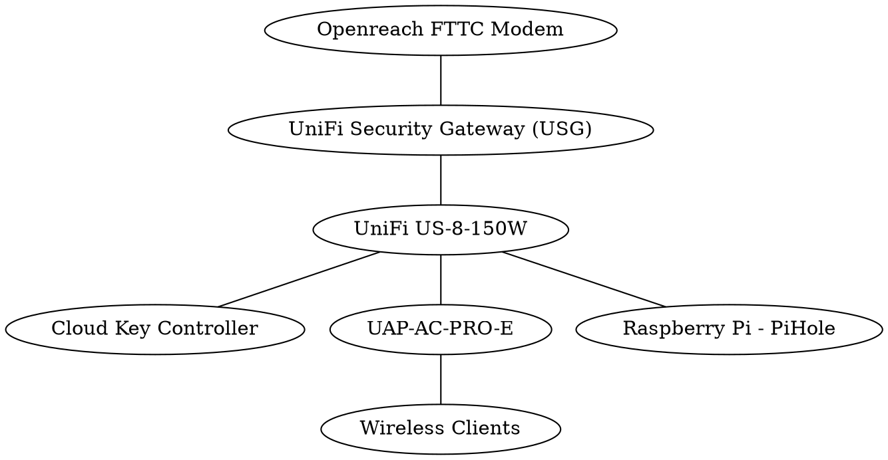

# Wireless Network: `simian.collingwood`

Documentation and Designs for home network, with enhanced security.

## IP Range

- 10.229.0.0/16 (255.255.0.0)
  - 10.229.0.1 (Gateway) 
  - 10.229.0.7 (Cloud Key)
  - 10.229.1.5 (Raspberry Pi)
  - 10.229.5.2 - 10.229.5.254 (DHCP)
- 10.230.0.1 - 10.230.255.254 (VPN)

## Overview

## Raspberry Pi Configuration

1. Use [Etcher][etcher] to burn [Raspbian][raspbian] to an [SD Card][amazon-sdcard].
2. Mount the SD card and touch `/boot/ssh` on the SD Card.
3. Boot the Raspberry Pi and wait for it to appear in the UniFi controller.
4. Assign a static allocated IP address.
6. Run through the documentation in the [`ansible` folder][ansible-readme].

## Google Cloud Configuration

1. Create a Google Cloud Account.
2. Configure billing.
3. Run through the documentation in the [`terraform` folder][terraform-readme].

  [etcher]: https://www.balena.io/etcher/
  [raspbian]: https://www.raspberrypi.org/downloads/raspbian/
  [amazon-sdcard]: https://amzn.to/2By4TJm
  [ansible-vault]: https://docs.ansible.com/ansible/latest/user_guide/vault.html
  [ansible-readme]: ansible/README.md
  [terraform-readme]: terraform/README.md

## Tasks still to complete

 - [ ] Configure UniFi (Terraform Provider)
   - [ ] Configure Cloud Key
   - [ ] Configure Networks
     - [ ] LAN
     - [ ] VPN
     - [ ] WAN
   - [ ] Configure Wireless Networks
   - [ ] Configure UniFi Security Gateway
 - [ ] Configure Network Appliance
   - [ ] Install Pi-hole
 - [ ] Configure Cloud
   - [X] Cloud DNS
   - [X] Dynamic DNS
   - [X] VPN
   - [ ] Google Maps API Key
