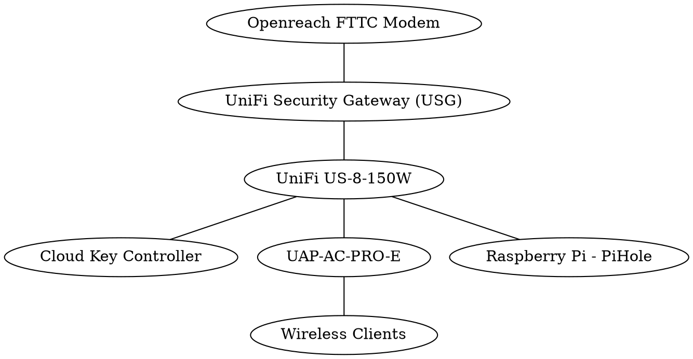

# Wireless Network: `simian.collingwood`

Documentation and Designs for home network, with enhanced security.

## IP Range

- 10.229.0.0/16 (255.255.0.0)
  - 10.229.0.1 (Gateway) 
  - 10.229.0.7 (Cloud Key)

## Overview

